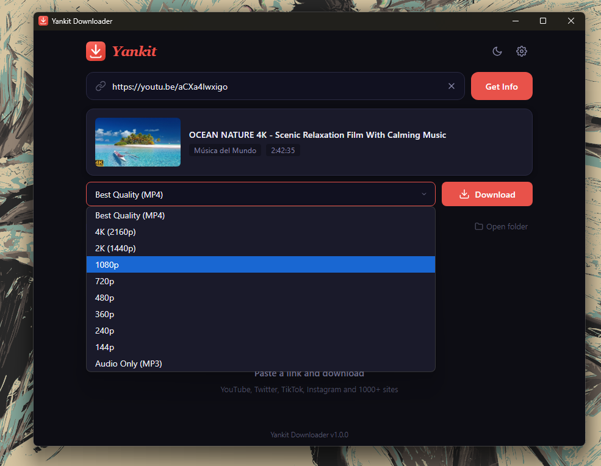
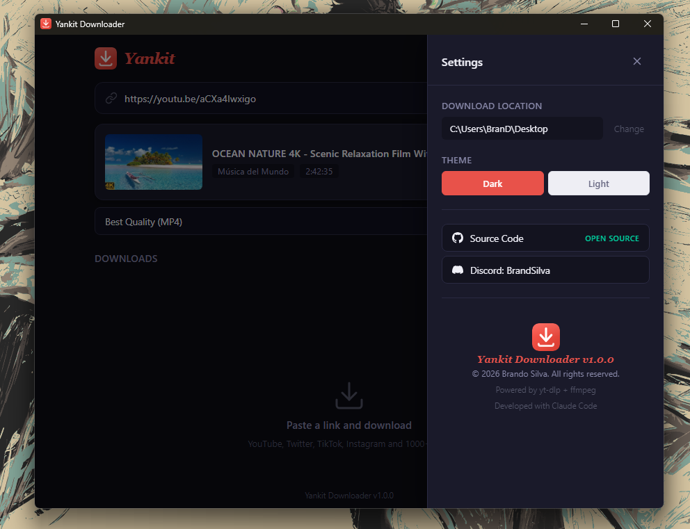

# Yankit Downloader

Download videos and audio from YouTube, Twitter, TikTok, Instagram and 1000+ sites.

A fast, clean desktop app for Windows and Linux. No ads, no tracking, no accounts.




## Features

- Downloads from 1000+ sites via [yt-dlp](https://github.com/yt-dlp/yt-dlp)
- Pick quality: Best, 4K, 1080p, 720p, or Audio Only (MP3)
- Multiple downloads at once with progress, speed, and ETA
- Choose your download folder
- Dark and Light theme
- Auto-update notifications
- Cleans up partial files on cancel

## Install

### Windows (Installer)

1. Go to [Releases](https://github.com/TridentSky/yankit/releases) and download **Yankit-Setup.exe**
2. Run the installer — Windows may show a blue **"Windows protected your PC"** warning because the app isn't signed yet. Click **"More info"** then **"Run anyway"**
3. Accept the admin prompt and choose your install folder
4. Done — a desktop shortcut and Start Menu entry are created for you
5. Everything is included (yt-dlp, ffmpeg), nothing else to install

> **Note:** If Windows blocks the installer completely (Smart App Control), go to **Settings > Privacy & Security > Windows Security > App & browser control > Smart App Control** and set it to **Off**. This only needs to be done once.

### Windows (From Source)

If you prefer to run from source instead of using the installer:

1. Install [Node.js](https://nodejs.org) (v18 or newer)
2. Install [yt-dlp](https://github.com/yt-dlp/yt-dlp): `pip install yt-dlp`
3. Download [FFmpeg](https://ffmpeg.org/download.html) and place `ffmpeg.exe` + `ffprobe.exe` in the `bin/` folder
4. Open the Yankit folder and run:
   ```
   npm install
   ```
5. Double-click **Yankit.vbs** to launch (no console window)

### Linux

1. Install [Node.js](https://nodejs.org) (v18 or newer)
2. Install yt-dlp and ffmpeg:
   ```bash
   pip install yt-dlp
   sudo apt install ffmpeg    # Ubuntu/Debian
   # or: sudo dnf install ffmpeg (Fedora)
   # or: sudo pacman -S ffmpeg (Arch)
   ```
3. Open the Yankit folder and run:
   ```bash
   chmod +x run.sh
   ./run.sh
   ```

The script installs Node dependencies on first run. On desktop Linux (GNOME, KDE, etc.) it opens as a native app window. On headless/server systems it starts a web interface at `http://localhost:3000`.

To run the web server manually: `node server.js` (custom port: `PORT=8080 node server.js`)

## Disclaimer

This tool is a frontend for [yt-dlp](https://github.com/yt-dlp/yt-dlp). It does not host, store, or distribute any media content. Users are solely responsible for ensuring their use complies with applicable laws and the terms of service of the sites they access. The developers assume no liability for misuse.

## Built With

- [yt-dlp](https://github.com/yt-dlp/yt-dlp) — download engine ([Unlicense](https://github.com/yt-dlp/yt-dlp/blob/master/LICENSE))
- [FFmpeg](https://ffmpeg.org) — media processing ([LGPL/GPL](https://ffmpeg.org/legal.html))
- [Electron](https://www.electronjs.org) — desktop framework
- Developed with [Claude Code](https://claude.ai/claude-code)

## License

MIT License — see [LICENSE](LICENSE) for details.

yt-dlp and FFmpeg are independent projects with their own licenses.
